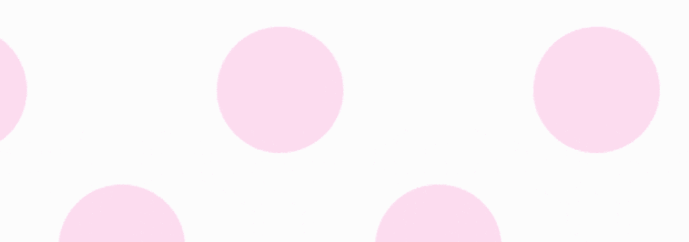
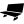
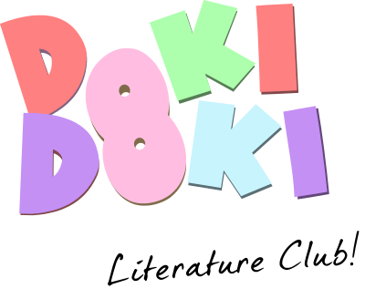
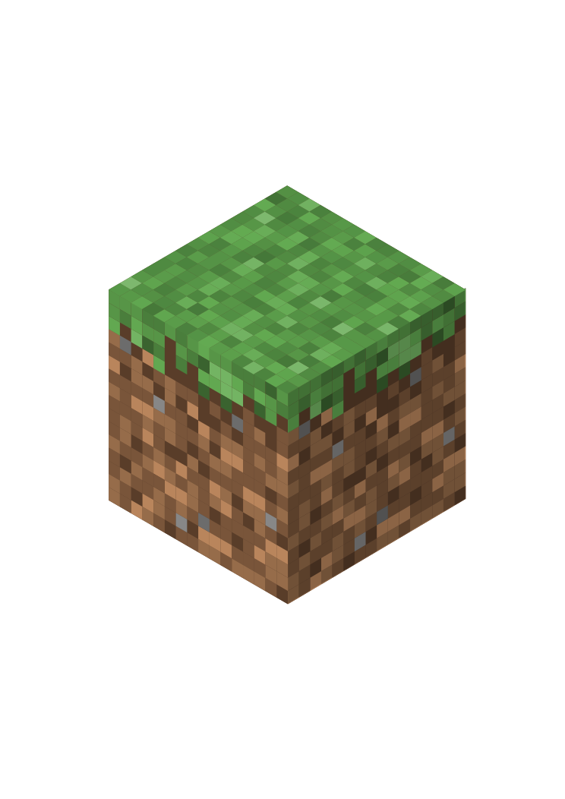
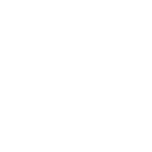

# Hi! 👋 I'm Dark

### Minecraft Bedrock Modder • Programmer • Creator

---

## 🟢 About Me

I'm **Dark**, a creator interested in **Minecraft Bedrock modding, programming, and YouTube**.

I enjoy building tools, experimenting with game assets, and creating things for the Minecraft community.

My main focus is **Minecraft Bedrock**, and I work across different versions depending on what's current.

---

## ⛏️ What I Do

<table>
<tr>
<td align="center" width="33%">

### Minecraft Bedrock

Addons, resource packs, skins, models, tools and other Minecraft-related projects.

</td>

<td align="center" width="33%">

### Programming

Building tools and experimenting with different technologies and ideas.

</td>

<td align="center" width="33%">

### YouTube

Creating Minecraft-related content and sharing projects with others.

</td>
</tr>
</table>

---

## 🚀 Featured Project

### MBSM — Minecraft Bedrock Skin Manager

**A free and open-source toolkit for Minecraft Bedrock skin creators.**

MBSM is a project focused on making working with Minecraft Bedrock skins easier by providing useful tools for creators and modders.

---

## 🛠️ Technologies & Tools

### Languages

### Tools

&nbsp;&nbsp;&nbsp;&nbsp;

---

## 🎮 Favorite Games

<table align="center">
<tr>
<td align="center" width="25%" height="120">

</td>

<td align="center" width="25%" height="120">

</td>

<td align="center" width="25%" height="120">

</td>

<td align="center" width="25%" height="120">

</td>
</tr>

<tr>
<td align="center" valign="top">

<strong>Doki Doki Literature Club!</strong>

</td>

<td align="center" valign="top">

<strong>Minecraft</strong>

</td>

<td align="center" valign="top">

<strong>Halo: Reach</strong>

</td>

<td align="center" valign="top">

<strong>Roblox</strong>

</td>
</tr>
</table>

---

## 🎵 A Few Favorites

<table align="center">
<tr>

<td align="center" width="33%">

### 🎵

**Favorite Artist**

TentaBeat

</td>

<td align="center" width="33%">

### 🎀

**Favorite Character**

Monika

</td>

<td align="center" width="33%">

### 🧩

**Favorite Software**

Blockbench

</td>

</tr>
</table>

---

### Thanks for stopping by! 💚

Feel free to explore my repositories.

 

